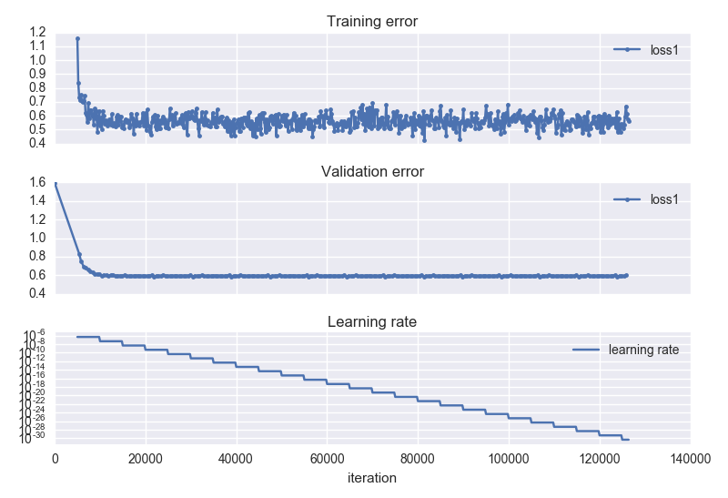

# Visualization

This directory contains visualization helpers.

## Learning rate visualization

The `learning_curves.py` parses `caffe`'s output from a log file and renders the obtained losses.

Usage:

```bash
python learning_curves.py logfile.log
```

If no file is specified, the newest `*.log` file from the `log/` subdirectory is used, should it exist.

### Example output



If multiple loss outputs exist, all will be rendered.