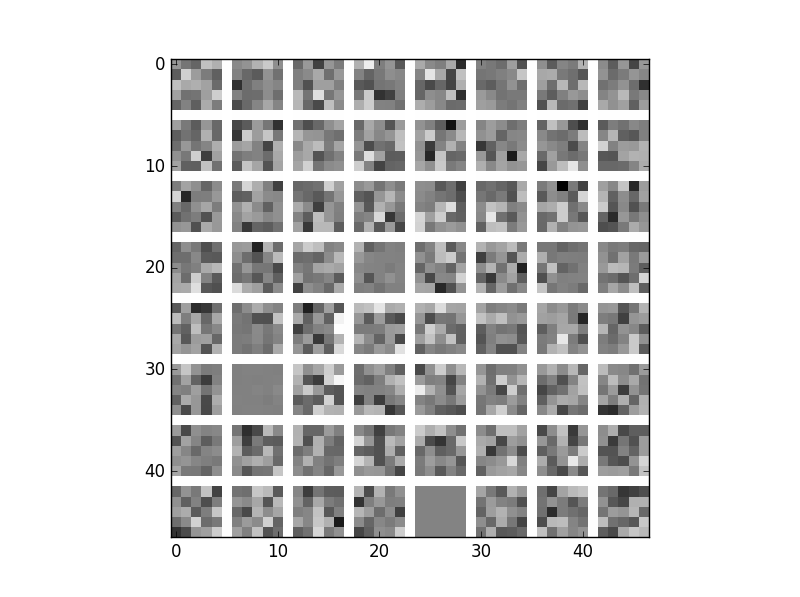

# Visualization

This directory contains visualization helpers.

## Learning rate visualization

The `learning_curves.py` parses `caffe`'s output from a log file and renders the obtained losses.

Usage:

```bash
python learning_curves.py logfile.log
```

If no file is specified, the newest `*.log` file from the `log/` subdirectory is used, should it exist.

### Example output


If multiple loss outputs exist, all will be rendered.

## First layer kernel visualization

The `layerviz.py` script visualizes the kernel weights of 1D or 3D kernels in the first layer. It is inspired by [this](https://github.com/gustavla/caffe-weighted-samples/blob/master/examples/filter_visualization.ipynb) Jupyter notebook.

Usage:

```bash
python learning_curves.py -m network.prototxt weights.caffemodel
```

If no model definition is specified via `-m`, the file automatically loads the `training.prototxt` from the current directory, should it exist.

### Example output

The following shows the visualization of a badly trained network (note how the kernels mostly resemble noise instead of features).


